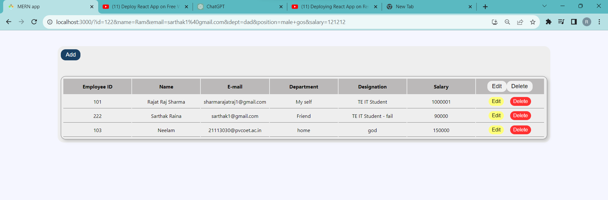
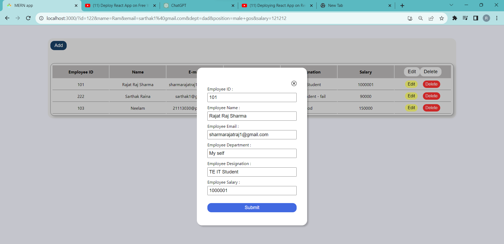
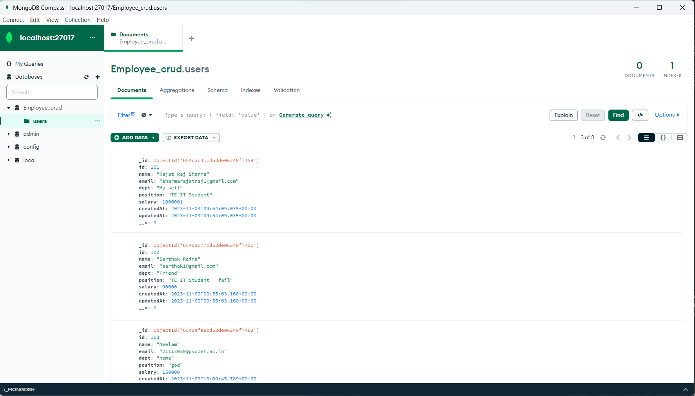

# Employee Management System

This project is a simple web application for managing employee data.

## Overview

This web application allows you to perform the following actions:

- Add new employees to the system
- Edit existing employee records
- Delete employee records
- View the list of employees

## How to Use

1. Clone this repository to your local machine.
2. Install the necessary dependencies by running `npm install`.
3. Run the application locally using `npm start`. The app will open in your web browser at [http://localhost:3000](http://localhost:3000).
4. Follow the on-screen instructions to manage employee data.

## Project Structure

This project is structured as follows:

- `src/` contains the React application code.
- `server/` contains the Node.js server code for managing the database.

## YouTube Tutorial

[Watch the YouTube tutorial](https://www.youtube.com/watch?v=P7WJbUP71uM&t=40s) to learn how to set up and use this project. The tutorial provides a step-by-step guide on how to run the application and manage employee data.

## Screenshots

### Website

### Form

### Database (MongoDB)

## Additional Information

For more details, you can refer to the [Create React App documentation](https://facebook.github.io/create-react-app/docs/getting-started) and [React documentation](https://reactjs.org/).

## Deployment

To deploy this application for production, you can use the `npm run build` command, which will generate a production-ready build in the `build` folder.

## Troubleshooting

If you encounter any issues, please check the [troubleshooting guide](https://facebook.github.io/create-react-app/docs/troubleshooting#npm-run-build-fails-to-minify) provided in the Create React App documentation.

